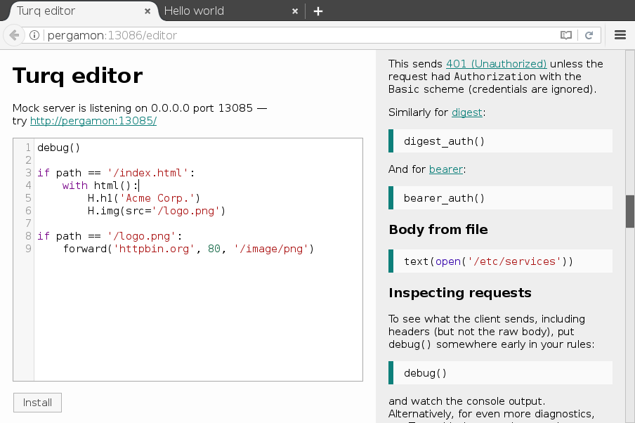

Turq
====

.. status:
.. image:: https://img.shields.io/pypi/v/turq.svg?
   :target: https://pypi.python.org/pypi/turq
.. image:: https://img.shields.io/pypi/pyversions/turq.svg?
   :target: https://pypi.python.org/pypi/turq
.. image:: https://readthedocs.org/projects/turq/badge/?version=latest
   :target: http://turq.readthedocs.io/en/latest/
.. image:: https://travis-ci.org/vfaronov/turq.svg?branch=master
   :target: https://travis-ci.org/vfaronov/turq
.. image:: https://ci.appveyor.com/api/projects/status/srfa9mlgafe63o6d?svg=true
   :target: https://ci.appveyor.com/project/vfaronov/turq

Turq is a small HTTP server that can be scripted in a Python-based language.
Use it to set up **mock HTTP resources** that respond with the status, headers,
and body of your choosing. Turq is designed for **quick interactive testing**,
but can be used in automated scenarios as well.

Lets you do things like
-----------------------

"RESTful API" resource with cross-origin support::

    if route('/v1/products/:product_id'):
        if GET or HEAD:
            json({'id': product_id, 'inStock': True})
        elif PUT:
            json(request.json)      # As if we saved it
        elif DELETE:
            status(204)
        cors()      # Handles preflight requests automatically

Redirect to an ``index.php``, which serves a gzipped, cacheable page
after 3 seconds of "loading"::

    if path == '/':
        redirect('/index.php')

    if path == '/index.php':
        sleep(3)
        html()
        gzip()
        header('Cache-Control', 'max-age=3600')

Stream `server-sent events`_::

    header('Content-Type', 'text/event-stream')
    for i in range(9000):
        sleep(1)
        chunk('data: event number %d\r\n\r\n' % i)

.. _server-sent events: https://en.wikipedia.org/wiki/Server-sent_events

Built-in editor
---------------

You don't even need to create any files, just use the built-in Web editor:

Get it now
----------

In any Python 3.4+ environment::

    $ pip3 install turq
    $ turq

`Read the docs <http://turq.readthedocs.io/>`_ for more.

Thanks
------

`BrowserStack`_ have kindly provided a free subscription for testing Turq.

.. _BrowserStack: https://www.browserstack.com/
